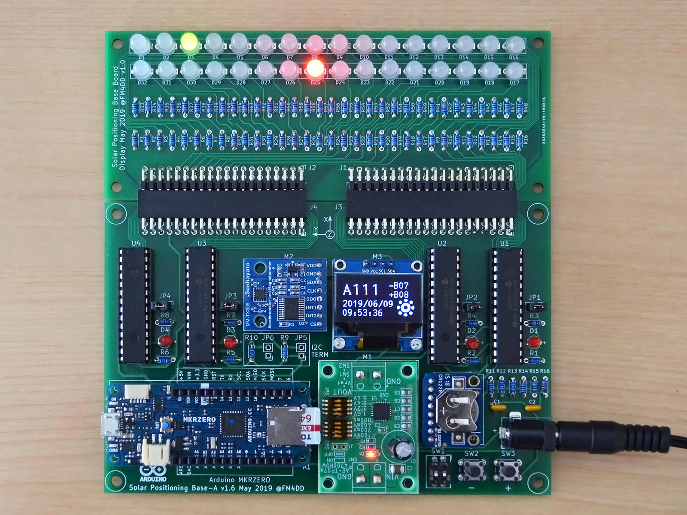
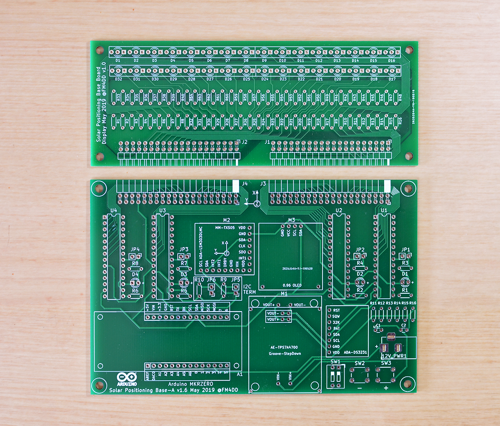

# SunTracker2 Revision 2

This project develops a photovoltaic (PV) solar tracking controller.
Pictured above is the revision 2 prototype. PV solar trackers control the PV
panel direction to keep the panel perpendicular to the Sun, maximizing the
power output. The power output difference for a fully aligned panel is
reported to be in a range of 15~40%, which would be substantial.

## Design

The goal is a self-orienting dual-axis, scheduled, Arduino-based solar
tracker. I want to control PV panel orientation for both Elevation and
Azimuth angles (dual-axis), based on the calculated solar position of a PV
systems specific geographic location and time (scheduled).

Working under space, cost and time constraints, the prototype development is
done on a small scale model. Eventually, I want to control and optimize the
orientation of Mini-PV systems.

This is a interim revision to establish PCB design and manufacturing.

### Board Description and Components

The main controller board contains the 32bit Arduino MKRZero MCU, the
LSM303 magnetometer sensor, DS3231 RTC clock module, and four 16pin GPIO expander
circuits. A 128x64 OLED display shows operational data and status messages.

A 32 color LED display board connects to the controller board to develop the 
GPIO controller functions for the sun positioning display.

In the next revision, the 32 LED ring will form a ring that represents the horizon
with north, sunrise and sunset indicators, and a green indicator to display the
suns daily movement over time.

The solar position data gets calculated off-system in advance, and saved into a
micro SD card. The pre-generated daily sun position files are then read by the
Arduino MKR Zero microcontroller through the onboard card reader. The
astronomical calculations of the suns position require sufficient CPU power, and
are taxing on Microcontrollers.

At the moment I am using a sun position dataset that covers two years of
operation, and uses approx. 20MB in size (46 MB with additional debug data). I
wrote the “suncalc” tool to pre-calculate the data set files for a specific
location, on a Linux PC.

### PCB

